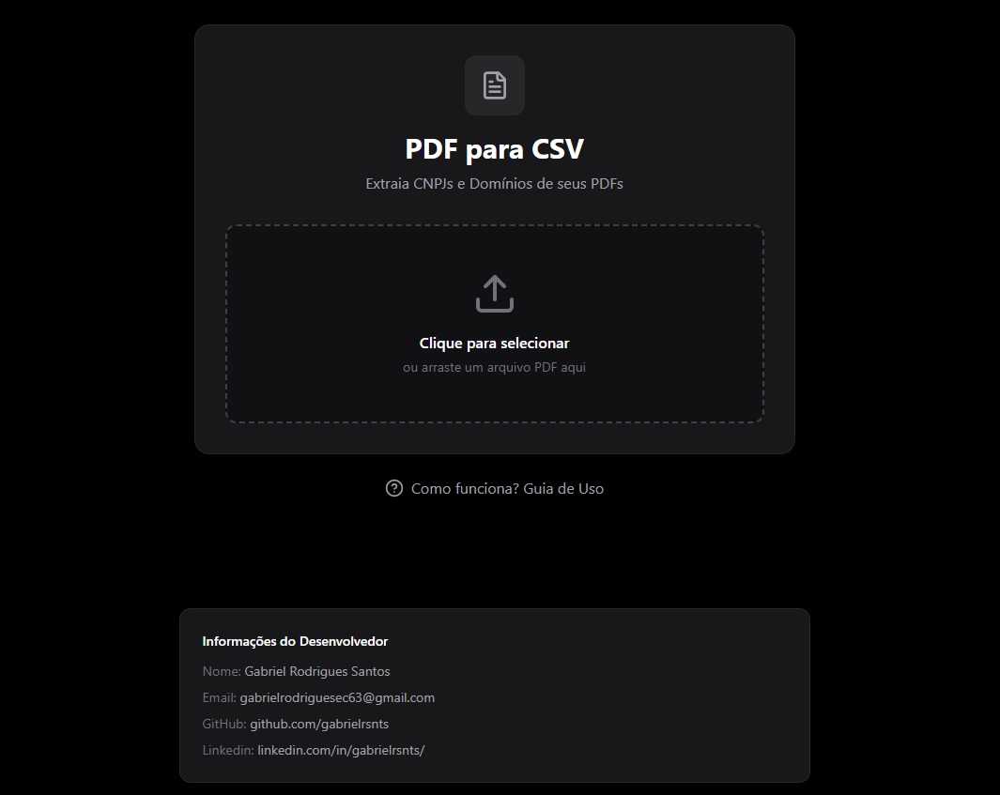

# 🚀 Extrator de CNPJs e Domínios de PDF

Uma aplicação web full-stack que extrai CNPJs e domínios de arquivos PDF, associando-os corretamente e permitindo o download dos resultados em formato CSV.

### ✨ [Acesse a Aplicação Online Clicando Aqui!](https://extractor-cn-pj-dominio-pdf.vercel.app/) ✨


---

## 📄 Sobre o Projeto

Este projeto foi desenvolvido para solucionar a necessidade de extrair dados estruturados (CNPJs e domínios) de documentos PDF, onde a estrutura de tabela nem sempre é confiável. A aplicação utiliza um backend em Python para processar o arquivo e um frontend moderno em React para a interação com o usuário.

### Funcionalidades Principais

* **Upload de Arquivos:** Interface simples para o usuário enviar um arquivo PDF.
* **Extração Inteligente:** O backend lê o PDF bloco por bloco, garantindo a extração de dados mesmo em layouts complexos.
* **Reconhecimento de Padrões:**
    * Identifica CNPJs no formato padrão (`XX.XXX.XXX/XXXX-XX`).
    * Identifica domínios de qualquer tipo (`.com`, `.com.br`, etc.), desde que estejam em letras minúsculas.
* **Associação Correta:** A lógica do backend associa corretamente múltiplos domínios a um único CNPJ, respeitando a ordem de leitura do documento.
* **Download em CSV:** Gera e permite o download de um arquivo `.csv` com os dados extraídos, pronto para ser usado em planilhas.

## 🛠️ Tecnologias Utilizadas

Este projeto é dividido em duas partes principais:

* **Frontend:**
    * [React](https://reactjs.org/) (com [Vite](https://vitejs.dev/))
    * [TypeScript](https://www.typescriptlang.org/)
    * [Axios](https://axios-http.com/) para as requisições HTTP
    * [Tailwind CSS](https://tailwindcss.com/) para estilização

* **Backend:**
    * [Python](https://www.python.org/)
    * [Flask](https://flask.palletsprojects.com/) como framework web
    * [PyMuPDF](https://pymupdf.readthedocs.io/en/latest/) para extração de texto do PDF
    * [Gunicorn](https://gunicorn.org/) como servidor WSGI para produção

* **Deploy:**
    * Backend deployado no [Render](https://render.com/).
    * Frontend deployado na [Vercel](https://vercel.com/).

---

## ⚙️ Como Rodar o Projeto Localmente

Caso queira testar, modificar ou contribuir com o projeto, siga os passos abaixo para executá-lo em sua máquina.

### Pré-requisitos

* [Git](https://git-scm.com/)
* [Node.js e npm](https://nodejs.org/en/)
* [Python 3](https://www.python.org/downloads/)

### Passo a Passo

1.  **Clone o repositório:**
    ```bash
    git clone <url-do-repositorio>
    cd Extractor_CNPj_Dominio_PDF
    ```

2.  **Configure e rode o Backend:**
    * Abra um terminal na pasta do projeto.
    * Navegue até a pasta do backend:
        ```bash
        cd backend
        ```
    * Crie e ative um ambiente virtual:
        ```bash
        # Criar o ambiente
        python -m venv venv

        # Ativar no Windows
        .\venv\Scripts\activate

        # Ativar no macOS/Linux
        source venv/bin/activate
        ```
    * Instale as dependências:
        ```bash
        pip install -r requirements.txt
        ```
    * Inicie o servidor Flask:
        ```bash
        flask run
        ```
    * O backend estará rodando em `http://127.0.0.1:5000`. Deixe este terminal aberto.

3.  **Configure e rode o Frontend:**
    * Abra um **novo terminal** na pasta raiz do projeto.
    * Navegue até a pasta do frontend:
        ```bash
        cd frontend
        ```
    * Instale as dependências:
        ```bash
        npm install
        ```
    * Inicie a aplicação React:
        ```bash
        npm run dev
        ```
    * A aplicação abrirá automaticamente no seu navegador, geralmente em `http://localhost:5173` (ou outra porta indicada pelo Vite).

Agora você está pronto para testar a aplicação localmente!

---

## ⚖️ Licença e Contribuição

Este é um projeto de código aberto, liberado para toda a comunidade de desenvolvedores. Você pode usar, modificar e distribuir o código livremente.

A única coisa que peço em troca é o **crédito ao autor original** caso você utilize este projeto ou partes dele em seus próprios trabalhos. Uma menção com um link para um dos meus perfis já é o suficiente.

## 👨‍💻 Autor

Feito com ❤️ por **Gabriel Rodrigues Santos**.

* **LinkedIn:** [https://www.linkedin.com/in/gabrielrsnts](https://www.linkedin.com/in/gabrielrsnts)
* **GitHub:** [https://github.com/gabrielrsnts](https://github.com/gabrielrsnts)
